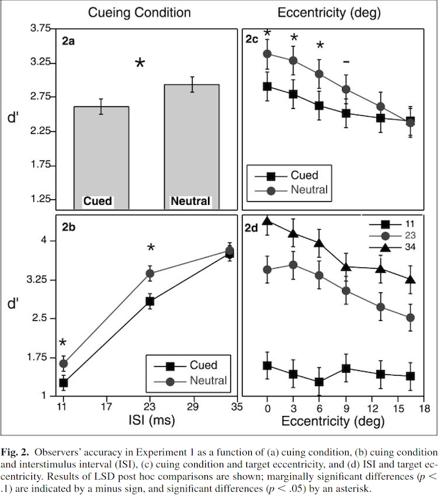
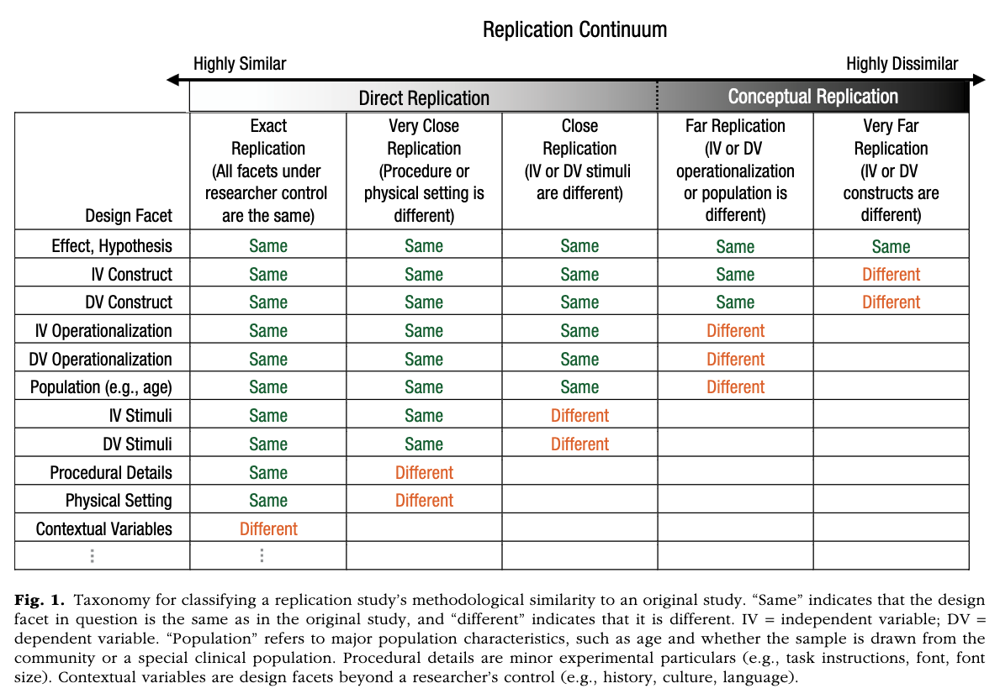

# Introduction

In this preliminary visual attention study, Yeshurun and Levy (2003) investigated the relationship between spatial attention and temporal resolution. Perhaps surprisingly, their findings suggest that spatial attention does not enhance performance for all visual tasks. They observed a negative relationship between spatial attention and temporal resolution: Increased spatial attention degraded performance in the temporal resolution task.

Required Stimuli & Procedures:"Two flashes of light were presented successively to the same location, and we determined the minimal interval between the flashes at which they were still perceived as two separate flashes, rather than as a single continuous flash. The shorter this critical interval is, the higher the temporal resolution. This measurement of temporal resolution was combined with a direct manipulation of transient spatial attention. In half the trials, the cued trials, a peripheral cue indicated the target’s onset and location. This exogenous cue, a small horizontal bar, allowed observers to focus their attention, in advance, on the target location, and was assumed to capture attention in a stimulus-driven, automatic manner. In the rest of the trials, the neutral trials, two long horizontal lines indicated the target’s onset but not its location (i.e., the target was equally likely to appear at any location)." (Yeshurun & Levy, 2003, p.226) 

Link to Repo: https://github.com/psych251/yeshurun2003_rescue/tree/main 
Link to RPubs: https://rpubs.com/irmak_ergin
Link to Original Paper: https://github.com/psych251/yeshurun2003_rescue/blob/main/original_paper/Yeshurun%20%26%20Levy(2003).pdf
Link to First Replication Attempt: https://github.com/psych251/Yeshurun2003

# Summary of prior replication attempts

## PSYCH251 1st  Replication Project

General summary of the prior replication attempt/original experiment: As in the original study, each observer's threshold of temporal resolution were  measured in two different conditions (cued and neutral). In cued trials, a periphery cue were presented before the target onset, which indicates the target’s location. While in neutral trials, neutral cue with no indication of the target’s location were presented. 
The results from the original study was not replicated:
* No main effect of cueing was observed in the prior replication attempt,unlike the original study. 
* The original study reported no interaction effect between cueing and ISI. Whereas, the first replication study found a significant interaction effect between cueing and ISI: In longer ISI conditions, spatial attention enhanced performance in the temporal resolution task, while in shorter ISI, spatial attention degraded the performance.

The original study had 18 participants while the 1st replication study had 10. The author of the 1st replication notes that this was due to not being able to reach out to enough Psych1 students as they were collecting data in-person.This might be the reason behind not being able to replicate the original study. 

The original study did not report any exclusion from the sample. The 1st replication report states that no participant's data was excluded from the study.

The original experiment and the 1st replication study have the same analysis methods but the replication study did not analyze the Reaction Time (RT) data. The original experiment did not find significant effects on RT. 

## Forward Literature Search for Other Replication Attempts

A forward literature search was conducted to find possible replication studies of the original paper, other than the 1st replication project done by Insub Kim for the PSYCH251 class. 
Chica & Christine (2009) Experiment 1: Using 12 participants, they replicated the finding that temporal resolution is impaired on spatially cued trials as compared with neutral trials, even when controlled for Reaction Time. 

# Methods

## Power Analysis
The effect size is not reported in the original paper.The first replication study had 10 participants although it aimed to have 18 as in the original study. Therefore, I aim to get 18 participants following the number of participant reported in the original paper and see if I can replicate the findings.

## Planned Sample

There will be no pre-selection rules except for normal or corrected-to-normal vision.
I will recruit data from 18 PSYCH1 participants via a 2023 MacBook Pro. Participants will receive a 0.5 course credit for participation.

## Materials

Two-flash fusion threshold: Measure of temporal resolution. "Two flashes of light were presented successively to the same location, and we determined the minimal interval between the flashes at which they were still perceived as two separate flashes, rather than as a single continuous flash. The shorter this critical interval is, the higher the temporal resolution (e.g., Artieda, Pastor, Lacruz, & Obeso, 1992;Reeves, 1996)."

Target: The target (37-cd/m2 disk with a diameter of 3 degrees) was composed of two flashes of light separated by a brief interval or a single continuous flash. "It appeared on a black background at one of 11 possible locations along the horizontal meridian, with eccentricity (distance from the center) ranging from 0 to 16.5 degrees. The cue in the cued trials was a 1 X 0.3 degrees green horizontal bar (43 cd/m2) appearing 0.5 degree above the target’s location. In the neutral trials, two 17 x 0.3 degree green horizontal lines appeared above and below the entire display." 

(taken from the original paper & the first replication attempt report)

## Procedure	

I am planning to follow the exact procedure of the original study, used by the 1st replication attempt as well. Quoting from the original article:

"Each trial began with a fixation point followed by the attentional cue. The cue was present until the target’s offset, to prevent confusion between the flickering of the cue and that of the target. The target was presented 94 ms after onset of the cue: On 50% of the trials, two disks appeared, each for 47 ms, separated by a variable interval (inter stimulus interval, ISI, of 11–34 ms). On the rest of the trials, a single disk was presented for a duration ranging from 105 to 130 ms. These brief durations ensured that eye movements could not occur between cue onset and target offset (Mayfrank, Kimmig, & Fischer,1987). Each observer viewed 864 trials presented in a randomized order. Both accuracy and reaction time (RT) were recorded."


Link to experiment code: https://github.com/psych251/yeshurun2003_rescue/blob/main/data/spaital_temporal.m 

## Controls
No controls or attention checks were added to the design.

## Analysis Plan
The original study do not mention any participant or data exclusion.
Participants were required to have normal or corrected to normal vision.

"Dependent Variables:

  - Accuracy(d') was calculated following equation: d' = z(hit) - z(false alarm), (Macmillan & Creelman, 1991). 
  - Criterion(c, measure of response bias) was calculated using: c = -0.5(z(hit) + z(false alarm)), (Macmillan & Creelman, 1991). 
  - Reaction Time (RT)"*

Analysis of Interest:
  
  "- Differences between cued and neutral trials
   - The effect of inter-stimulus interval (ISI)"*

Key analysis: A within-subject three-way analysis of variance (ANOVA; Cuing x Eccentricity x ISI) will be performed on the accuracy (d') and RT data collected on trials with correct responses. 
The original study does not state a directional hypothesis in the Introduction section, but in Experiment 1 it is written that " ...we reasoned that attending to the location of this temporal target might decrease temporal resolution. Alternatively, the effects of attention on temporal resolution might not be constrained by its effects on spatial resolution." (p.226)
  
*Quoted sections are taken from the 1st replication report.

# Differences from Original Study and 1st replication

The only difference I can see is that the first replication study had 10 participants although it aimed to have 18 as in the original study. This was dues to collecting data in-person and not being able to find enough participants in time. I will be collecting data from PPSYCH1 students.

The 1st replication attempt collected but not analyzed RT data, unlike the original experiment. I will be analyzing the effects of cueing, ISI, and eccentricity on RT as well as on accuracy (d prime). 

# Methods Addendum (Post Data Collection)

## Actual Sample
18 Psych1 students participated in the experiment in exchange for credit.

## Differences from pre-data collection methods plan
There were no differences from planned.

# Results

## Data preparation

Link to data organization code (to be able to take transfer the data from MATLAB to R): https://github.com/psych251/yeshurun2003_rescue/blob/main/data/Mat2R.m 

Data preparation plan: 
- Load the data
- Cued and neural trials will be determined. (changing variable names to more "intuitive" ones)
- Compute accuracy (d prime) value based on the equation stated in the analysis plan section.
- Calculate the mean d primes per subgroups for analysis and plotting. E.g. for cuing conditions (cued vs neural), eccentricity x cue, ISI x cue, eccentricity x ISI. 
- Calculate the mean RTs per subgroups for analysis and plotting. E.g. for cuing conditions (cued vs neural), eccentricity x cue, ISI x cue, eccentricity x ISI. 

The data preparation code below has taken from the first replication report with changes.
	


```r
####Load Relevant Libraries and Functions

library(tidyverse)
```

```
## ── Attaching core tidyverse packages ──────────────────────── tidyverse 2.0.0 ──
## ✔ dplyr     1.1.3     ✔ readr     2.1.4
## ✔ forcats   1.0.0     ✔ stringr   1.5.0
## ✔ ggplot2   3.4.4     ✔ tibble    3.2.1
## ✔ lubridate 1.9.3     ✔ tidyr     1.3.0
## ✔ purrr     1.0.2     
## ── Conflicts ────────────────────────────────────────── tidyverse_conflicts() ──
## ✖ dplyr::filter() masks stats::filter()
## ✖ dplyr::lag()    masks stats::lag()
## ℹ Use the conflicted package (<http://conflicted.r-lib.org/>) to force all conflicts to become errors
```

```r
library(ggplot2)
library(ggthemes)
library(psycho)
library(ggpubr)
library(gridExtra)
```

```
## 
## Attaching package: 'gridExtra'
## 
## The following object is masked from 'package:dplyr':
## 
##     combine
```

```r
library(cowplot)
```

```
## 
## Attaching package: 'cowplot'
## 
## The following object is masked from 'package:ggpubr':
## 
##     get_legend
## 
## The following object is masked from 'package:ggthemes':
## 
##     theme_map
## 
## The following object is masked from 'package:lubridate':
## 
##     stamp
```

```r
library(emmeans)

####Import data

d <- read_csv("Experiment.csv")
```

```
## Rows: 3888 Columns: 9
## ── Column specification ────────────────────────────────────────────────────────
## Delimiter: ","
## chr (2): sub, SDT
## dbl (7): cue, numFlash, targetLoc, ISI, response, RT, accuracy
## 
## ℹ Use `spec()` to retrieve the full column specification for this data.
## ℹ Specify the column types or set `show_col_types = FALSE` to quiet this message.
```

```r
#### Prepare data for analysis - create columns and change variable names
#Create a new column 'cue' in the dataset d. If the value in the 'cue' column is 1, it assigns 'cued', otherwise 'neutral' to the new 'cue' column.

d$cue <- ifelse(d$cue == 1, 'cued', 'neutral')

#Generate new subject names with the format "s0XX" (where XX is a two-digit number) for each unique subject in the 'sub' column and assign these new names to the 'sub' column in the dataset.

x=1:length(unique(d$sub))
new_subNames=sprintf("s0%02d",x)
subNames = unique(d$sub)
for(i in 1:length(subNames)) {
  d$sub[d$sub == subNames[i]] = new_subNames[i]
}
end
```

```
## function (x, ...) 
## UseMethod("end")
## <bytecode: 0x11ac80090>
## <environment: namespace:stats>
```

```r
head(d)
```

```
## # A tibble: 6 × 9
##   cue     numFlash targetLoc   ISI response      RT accuracy sub   SDT  
##   <chr>      <dbl>     <dbl> <dbl>    <dbl>   <dbl>    <dbl> <chr> <chr>
## 1 cued           1         5    35        2 0.00205        0 s001  FA   
## 2 neutral        2         3    35        2 0.00409        1 s001  HI   
## 3 neutral        2         4    35        2 0.00173        1 s001  HI   
## 4 neutral        2         5    23        1 0.00147        0 s001  MI   
## 5 cued           1         2    11        1 0.00246        1 s001  CR   
## 6 neutral        2         2    11        2 0.00190        1 s001  HI
```


```r
# TargetLoc is the column with eccentricity information that are arbitraryly labeled from 1 to 6 in the stimulus creation code. The code below assigns back eccentricity values to 'targetLoc' labels. 

kk = sort(unique(d$targetLoc))
mask1=d$targetLoc ==kk[1]
mask2=d$targetLoc ==kk[2]
mask3=d$targetLoc ==kk[3]
mask4=d$targetLoc ==kk[4]
mask5=d$targetLoc ==kk[5]
mask6=d$targetLoc ==kk[6]

d$targetLoc[mask1] = 0
d$targetLoc[mask2] = 3
d$targetLoc[mask3] = 6
d$targetLoc[mask4] = 9
d$targetLoc[mask5] = 13
d$targetLoc[mask6] = 16

# Convert  'cue,' 'targetLoc,' and 'ISI' columns in the dataset to factors
d <- d %>% mutate( 
  cue = factor(cue),targetLoc = factor(targetLoc), ISI = factor(ISI)
)
```


```r
# Compute dPrime

dp <- d %>% group_by(sub,cue,targetLoc,ISI) %>% summarize(nHit = sum(SDT == 'HI' ), nFA = sum(SDT == 'FA' ), nMiss = sum(SDT == 'MI' ), nCR = sum(SDT == 'CR' ), dPrime= dprime(nHit, nFA, nMiss, nCR)$dprime, criterion=dprime(nHit, nFA, nMiss, nCR)$c) 
```

```
## `summarise()` has grouped output by 'sub', 'cue', 'targetLoc'. You can override
## using the `.groups` argument.
```

```r
# Make sub-selection of the data for plotting later on -accuracy

dplot_cue <- dp %>% group_by(sub,cue) %>% summarize(dPrime = mean(dPrime))
```

```
## `summarise()` has grouped output by 'sub'. You can override using the `.groups`
## argument.
```

```r
dplot_ecc <- dp %>% group_by(cue,targetLoc) %>% summarize(dPrime = mean(dPrime))
```

```
## `summarise()` has grouped output by 'cue'. You can override using the `.groups`
## argument.
```

```r
dplot_ecc2 <- dp %>% group_by(targetLoc,ISI) %>% summarize(dPrime = mean(dPrime))
```

```
## `summarise()` has grouped output by 'targetLoc'. You can override using the
## `.groups` argument.
```

```r
dplot_ISI <- dp %>% group_by(cue,ISI) %>% summarize(dPrime = mean(dPrime))
```

```
## `summarise()` has grouped output by 'cue'. You can override using the `.groups`
## argument.
```

```r
dplot_stat_ISI <- dp %>% group_by(sub,cue,ISI) %>% summarize(dPrime = mean(dPrime))
```

```
## `summarise()` has grouped output by 'sub', 'cue'. You can override using the
## `.groups` argument.
```

```r
dplot_ecc_sd <- dp %>% group_by(sub,targetLoc,ISI) %>% summarize(dPrime = mean(dPrime))
```

```
## `summarise()` has grouped output by 'sub', 'targetLoc'. You can override using
## the `.groups` argument.
```

```r
dplot_ecc_sd
```

```
## # A tibble: 324 × 4
## # Groups:   sub, targetLoc [108]
##    sub   targetLoc ISI   dPrime
##    <chr> <fct>     <fct>  <dbl>
##  1 s001  0         11    0.416 
##  2 s001  0         23    0     
##  3 s001  0         35    2.30  
##  4 s001  3         11    0.416 
##  5 s001  3         23    0.734 
##  6 s001  3         35    1.88  
##  7 s001  6         11    0.0972
##  8 s001  6         23    1.05  
##  9 s001  6         35    1.57  
## 10 s001  9         11    0.319 
## # ℹ 314 more rows
```


```r
# Make sub-selection of the data for RT
dplot_cue <- dp %>% group_by(sub, cue) %>% summarize(dPrime = mean(dPrime), .groups = 'keep')
dplot_ecc <- dp %>% group_by(cue, targetLoc) %>% summarize(dPrime = mean(dPrime), .groups = 'keep')
dplot_ecc2 <- dp %>% group_by(targetLoc, ISI) %>% summarize(dPrime = mean(dPrime), .groups = 'keep')
dplot_ISI <- dp %>% group_by(cue, ISI) %>% summarize(dPrime = mean(dPrime), .groups = 'keep')
dplot_stat_ISI <- dp %>% group_by(sub, cue, ISI) %>% summarize(dPrime = mean(dPrime), .groups = 'keep')
```

## Results of control measures

There are no control measures planned for this study.

## Confirmatory analysis

Following the original paper, and as it was done in the 1st replication attempt, a within-subject three-way analysis of variance (ANOVA; Cuing x Eccentricity x ISI) will be performed on the accuracy (d') and RT data collected on trials with correct responses.

The key statistic of 3 way ANOVA anova was performed. The code below is taken by the first replication report.


```r
#Accuracy

# within-subject 3-way Anova on Accuracy (dPrime), testing the interaction of cue,eccentricity,and ISI
Result_accuracy <- aov(dPrime ~ (cue*targetLoc*ISI) + Error(sub/cue*targetLoc*ISI), data=dp)

summary(Result_accuracy)
```

```
## 
## Error: sub
##           Df Sum Sq Mean Sq F value Pr(>F)
## Residuals 17  59.79   3.517               
## 
## Error: targetLoc
##           Df Sum Sq Mean Sq
## targetLoc  5  15.48   3.097
## 
## Error: ISI
##     Df Sum Sq Mean Sq
## ISI  2  168.2    84.1
## 
## Error: sub:cue
##           Df Sum Sq Mean Sq F value Pr(>F)
## cue        1  0.586  0.5859   0.721  0.408
## Residuals 17 13.823  0.8131               
## 
## Error: sub:targetLoc
##           Df Sum Sq Mean Sq F value Pr(>F)
## Residuals 85  48.82  0.5744               
## 
## Error: sub:ISI
##           Df Sum Sq Mean Sq F value Pr(>F)
## Residuals 34  51.77   1.523               
## 
## Error: targetLoc:ISI
##               Df Sum Sq Mean Sq
## targetLoc:ISI 10  10.91   1.091
## 
## Error: sub:cue:targetLoc
##               Df Sum Sq Mean Sq F value Pr(>F)  
## cue:targetLoc  5  5.601  1.1202   3.098 0.0129 *
## Residuals     85 30.736  0.3616                 
## ---
## Signif. codes:  0 '***' 0.001 '**' 0.01 '*' 0.05 '.' 0.1 ' ' 1
## 
## Error: sub:cue:ISI
##           Df Sum Sq Mean Sq F value Pr(>F)
## cue:ISI    2  2.004  1.0020   1.186  0.318
## Residuals 34 28.716  0.8446               
## 
## Error: sub:targetLoc:ISI
##            Df Sum Sq Mean Sq F value Pr(>F)
## Residuals 170  65.94  0.3879               
## 
## Error: sub:cue:targetLoc:ISI
##                    Df Sum Sq Mean Sq F value Pr(>F)
## cue:targetLoc:ISI  10   3.77  0.3773   0.911  0.525
## Residuals         170  70.42  0.4142
```

```r
# main effect: Cuing
summary(Result_accuracy[5])
```

```
## 
## Error: sub:cue
##           Df Sum Sq Mean Sq F value Pr(>F)
## cue        1  0.586  0.5859   0.721  0.408
## Residuals 17 13.823  0.8131
```

```r
# interaction effect: Cuing X ISI
summary(Result_accuracy[10])
```

```
## 
## Error: sub:cue:ISI
##           Df Sum Sq Mean Sq F value Pr(>F)
## cue:ISI    2  2.004  1.0020   1.186  0.318
## Residuals 34 28.716  0.8446
```


```r
# RT

# Within-subject 3-way ANOVA - Reaction Time
Result_rt <- aov(RT ~ (cue * targetLoc * ISI) + Error(sub / cue * targetLoc * ISI), data = d)

# Summary of RT ANOVA
summary(Result_rt)
```

```
## 
## Error: sub
##           Df    Sum Sq   Mean Sq F value Pr(>F)
## Residuals 17 1.248e-05 7.342e-07               
## 
## Error: targetLoc
##           Df    Sum Sq   Mean Sq
## targetLoc  5 1.784e-06 3.568e-07
## 
## Error: ISI
##     Df    Sum Sq  Mean Sq
## ISI  2 8.519e-07 4.26e-07
## 
## Error: sub:cue
##           Df    Sum Sq   Mean Sq F value Pr(>F)  
## cue        1 5.446e-07 5.446e-07   7.713 0.0129 *
## Residuals 17 1.200e-06 7.060e-08                 
## ---
## Signif. codes:  0 '***' 0.001 '**' 0.01 '*' 0.05 '.' 0.1 ' ' 1
## 
## Error: sub:targetLoc
##           Df    Sum Sq   Mean Sq F value Pr(>F)
## Residuals 85 5.621e-06 6.613e-08               
## 
## Error: sub:ISI
##           Df    Sum Sq   Mean Sq F value Pr(>F)
## Residuals 34 3.483e-06 1.024e-07               
## 
## Error: targetLoc:ISI
##               Df    Sum Sq   Mean Sq
## targetLoc:ISI 10 2.368e-06 2.368e-07
## 
## Error: sub:cue:targetLoc
##               Df    Sum Sq   Mean Sq F value   Pr(>F)    
## cue:targetLoc  5 2.631e-06 5.262e-07   6.567 3.27e-05 ***
## Residuals     85 6.811e-06 8.010e-08                     
## ---
## Signif. codes:  0 '***' 0.001 '**' 0.01 '*' 0.05 '.' 0.1 ' ' 1
## 
## Error: sub:cue:ISI
##           Df    Sum Sq   Mean Sq F value  Pr(>F)   
## cue:ISI    2 8.558e-07 4.279e-07   6.251 0.00488 **
## Residuals 34 2.327e-06 6.850e-08                   
## ---
## Signif. codes:  0 '***' 0.001 '**' 0.01 '*' 0.05 '.' 0.1 ' ' 1
## 
## Error: sub:targetLoc:ISI
##            Df    Sum Sq   Mean Sq F value Pr(>F)
## Residuals 170 1.367e-05 8.041e-08               
## 
## Error: sub:cue:targetLoc:ISI
##                    Df    Sum Sq   Mean Sq F value   Pr(>F)    
## cue:targetLoc:ISI  10 3.209e-06 3.209e-07   3.942 7.57e-05 ***
## Residuals         170 1.384e-05 8.140e-08                     
## ---
## Signif. codes:  0 '***' 0.001 '**' 0.01 '*' 0.05 '.' 0.1 ' ' 1
## 
## Error: Within
##             Df  Sum Sq   Mean Sq F value Pr(>F)
## Residuals 3240 0.00031 9.569e-08
```

```r
# Main effect: Cuing
summary(Result_rt[5])
```

```
## 
## Error: sub:cue
##           Df    Sum Sq   Mean Sq F value Pr(>F)  
## cue        1 5.446e-07 5.446e-07   7.713 0.0129 *
## Residuals 17 1.200e-06 7.060e-08                 
## ---
## Signif. codes:  0 '***' 0.001 '**' 0.01 '*' 0.05 '.' 0.1 ' ' 1
```

```r
# Interaction effect: Cuing X ISI
summary(Result_rt[10])
```

```
## 
## Error: sub:cue:ISI
##           Df    Sum Sq   Mean Sq F value  Pr(>F)   
## cue:ISI    2 8.558e-07 4.279e-07   6.251 0.00488 **
## Residuals 34 2.327e-06 6.850e-08                   
## ---
## Signif. codes:  0 '***' 0.001 '**' 0.01 '*' 0.05 '.' 0.1 ' ' 1
```

The original paper found:
  
  For accuracy:
- Significant main effect of cuing: F(1,17)=8.01 p<.01
- No significant interactions: Cuing X ISI, Cuing X Eccentricity, and ISI X Eccentricity
- But the performance decrement in the cued trials was more pronounced for shorter ISIs (i.e., when a higher temporal resolution is required) than for longer ISIs and for more central, compared with more peripheral, eccentricities.
  
  For reaction time:
-Effects on RTs were not statistically significant.

The first replication project found:
 
  For accuracy:
- No significant main effect of cuing: F(1,9)=2.061 p=.0185
- Significant interaction effect of Cuing X ISI: F(2,18)=10.86 p<.001
- Reaction time data was not analyzed

  Reaction time data was not analyzed.

The rescue project (second replication) found:
  
  For accuracy:
- There are no significant mean effects. The presence of cues alone did not significantly effected accuracy.
- A significant interaction effect was observed between cueing and target location eccentricity, F(5, 85) = 3.098, p < 0.05, indicating that the influence of cues on accuracy varies across different spatial locations. 
  
  For reaction time:
- There was a significant main effect of cueing on reaction time, F(1, 17) = 7.713, p < 0.05, indicating that cueing significantly influenced reaction times.
-The interaction between cueing and ISI was significant, F(2, 34) = 6.251, p < .01, suggesting that the effect of cueing on reaction time varied across different ISIs.
- A significant three-way interaction was found, F(10, 170) = 3.942, p < .001, indicating that the combined effects of cueing, target location, and ISI on reaction time were significant.


```r
# Plotting

# Cueing effect
p1 <- ggplot(dplot_cue, aes(x=cue, y=dPrime))+
  geom_boxplot() +
  #geom_jitter((aes(colour = sub)), size=3, alpha=0.9) +
  scale_y_continuous(breaks = seq(0,3.75,0.5),limits = c(0,3.75))+
  ggtitle("Cueing Condition") +
  theme_classic()

#p1 <- ggplot(dplot_cue, aes(x=cue, y=dPrime))+
 # geom_bar(stat = "identity") +
 # scale_y_continuous(breaks = seq(0,3.75,0.5),limits = c(0,3.75))+
 # ggtitle("Cueing Condition") +
 # theme_classic()


# Cueing X Ecc
p2 <- ggplot(dplot_ecc, aes(x=targetLoc, y=`dPrime`, group=cue)) +
  geom_line(aes(linetype=cue))+
  geom_point(aes(shape=cue))+
  scale_y_continuous(breaks = seq(0,4,0.5),limits = c(0,4))+
  scale_x_discrete(name="Eccentricity (deg)")+
  ggtitle("Eccentricity") +
  theme_classic()

# Cueing X ISI
p3 <- ggplot(dplot_ISI, aes(x=ISI, y=dPrime, group=cue)) +
  geom_line(aes(linetype=cue))+
  geom_point(aes(shape=cue))+
  scale_y_continuous(breaks = seq(0,4,0.5),limits = c(0,4))+
  scale_x_discrete(name="ISI (ms)")+
  theme_classic()

# ECC X ISI
p4 <- ggplot(dplot_ecc2, aes(x=targetLoc, y=`dPrime`, group=ISI)) +
  geom_line(aes(linetype=ISI))+
  geom_point(aes(shape=ISI))+
  scale_y_continuous(breaks = seq(0,4,0.5),limits = c(0,4))+
  scale_x_discrete(name="Eccentricity (deg)")+
  theme_classic()

plot_grid(p1, p2, p3, p4,ncol = 2, nrow = 2)
```

<!-- -->

Figure 2. Results of the second replication

 



# Discussion and Summary of the Replication Attempt

Yeshurun & Levy (2003) found significant main effect of cueing on accuracy. The authors' interpretation of the results is as follows: Directing attention to the target location negatively impacted observers' ability to discern the temporal gap. This decline in performance might be attributed to the side effect of spatial attention improving the spatial resolution: The authors propose that the enhancement of spatial resolution by spatial attention might lead to a trade-off with temporal resolution, ultimately resulting in a detrimental impact on the latter. There were no significant effects on reaction time (RT)

The first replication attempt, on the other hand, found no significant main effect of cueing on accuracy but a significant interaction of cueing and inter stimulus interval (ISI). The results showed that in longer ISI conditions, spatial attention enhanced performance in the temporal resolution task, while in shorter ISI, spatial attention degraded the performance. Specifically, the post-hoc test of paired t test revealed that spatial attention enhanced the task performance in ISI of 11 ms, while spatial attention degraded the task performance in ISI of 35 ms. The effects on RT was not tested on the first replication attempt.   

The second replication attempt found no significant main effect of cueing on accuracy as well but there was a significant main  effect of accuracy on reaction time. Interection effects are reported in the 'Results' section. Overall, non of the results replicate across the original study and two replication attempts. This is might be due to different samples sizes employed in these three studies: While the original study and the second replication had 18 participants, the first replication attempt had 10 participants. It should be also noted that the original study was replicated by Chica & Christie (2009) with 12 participants.

# Mini meta analysis

The effect size was not reported on the original study. Therefore, I calculated the aggregate effect size using the effect sizes of the first and second replications for the key analysis (3 way ANOVA on accuracy- main effect of cueing).


```r
#Calculate effect size for first replication
# Given values from ANOVA output
ss_cue <- 1.534
ss_residuals <- 10.557

# Calculate partial eta-squared
eta_squared <- ss_cue / (ss_cue + ss_residuals)
eta_squared<-round(eta_squared, 2)
# Print the result with two decimal places
cat("Partial Eta-squared for cue:",eta_squared, "\n")
```

```
## Partial Eta-squared for cue: 0.13
```

```r
#Calculate effect size for second replication

## Given values from ANOVA output
ss_cue_2 <- 0.586
ss_residuals_2 <- 13.823
## Calculate partial eta-squared
eta_squared_2 <- ss_cue_2 / (ss_cue_2 + ss_residuals_2)
eta_squared_2 <-round(eta_squared_2, 2)
## Print the result with two decimal places
cat("Partial Eta-squared for cue:",eta_squared_2, "\n")
```

```
## Partial Eta-squared for cue: 0.04
```

```r
# Calculate aggregate effect size (average)
aggregate_effect_size <- (eta_squared+ eta_squared_2) / 2
# Print the result with two decimal places
cat("Aggregate Effect Size for cue across two experiments:", round(aggregate_effect_size, 2), "\n")
```

```
## Aggregate Effect Size for cue across two experiments: 0.09
```

```r
#Alternatively:
options(repos = c(CRAN = "https://cran.rstudio.com/"))
install.packages("metafor")
```

```
## Installing package into '/Users/irmakergin/Library/R/arm64/4.3/library'
## (as 'lib' is unspecified)
```

```
## 
## The downloaded binary packages are in
## 	/var/folders/s4/sw1k3wb56xl075rfw_q_80300000gr/T//RtmpyMZeoT/downloaded_packages
```

```r
library(metafor)
```

```
## Loading required package: Matrix
```

```
## 
## Attaching package: 'Matrix'
```

```
## The following objects are masked from 'package:tidyr':
## 
##     expand, pack, unpack
```

```
## Loading required package: metadat
```

```
## Loading required package: numDeriv
```

```
## 
## Loading the 'metafor' package (version 4.4-0). For an
## introduction to the package please type: help(metafor)
```

```r
# Given effect sizes and standard errors from two experiments
es_1 <- eta_squared
se_1 <- sqrt(ss_cue / (ss_cue + ss_residuals))

es_2 <- eta_squared_2
se_2 <- sqrt(ss_cue_2 / (ss_cue_2 + ss_residuals_2))

# Create a data frame with effect sizes and standard errors
forest_data <- data.frame(
  study = c("Experiment 1", "Experiment 2"),
  es = c(es_1, es_2),
  se = c(se_1, se_2)
)

# Create a meta-analysis model
meta_model <- rma(es, sei = se, data = forest_data)

# Print the summary of the meta-analysis
print(meta_model)
```

```
## 
## Random-Effects Model (k = 2; tau^2 estimator: REML)
## 
## tau^2 (estimated amount of total heterogeneity): 0 (SE = 0.1185)
## tau (square root of estimated tau^2 value):      0
## I^2 (total heterogeneity / total variability):   0.00%
## H^2 (total variability / sampling variability):  1.00
## 
## Test for Heterogeneity:
## Q(df = 1) = 0.0483, p-val = 0.8260
## 
## Model Results:
## 
## estimate      se    zval    pval    ci.lb   ci.ub    
##   0.0618  0.1755  0.3524  0.7245  -0.2821  0.4058    
## 
## ---
## Signif. codes:  0 '***' 0.001 '**' 0.01 '*' 0.05 '.' 0.1 ' ' 1
```

```r
# plot
forest(meta_model, showweights = TRUE, slab = forest_data$study)
```

<!-- -->
# Scale Ratings

*Using a 0-1 scale rating [0, .25, .5, .75, 1], how well did this rescue replicate the original results?*

On the above scale, I would rate the present rescue's replication of results a 0. Non of the original findings were replicated.

*Categorize your rescue for how close of a replication of the original it was using the scale in the Figure below:*

Based on the scale provided below, I would say that the present replication is a "very close replication" to "highly similar" replication. Although the participant pools may be potentially different and the original experiment code was not available, everything has been designed as described in the paper and data was collected in person.



# Commentary

Non of the results are replicated across three experiments (the original study, the first replication attempt, and the second replication attempt).

# References

Artieda, J., Pastor, M.A., Lacruz, F., & Obeso, J.A. (1992). Temporal discrimination is ab- normal in Parkinson disease. Brain, 115, 199–210. 

Chica, A. B., & Christie, J. (2009). Spatial attention does improve temporal discrimination. Attention, Perception &amp; Psychophysics, 71(2), 273–280. https://doi.org/10.3758/app.71.2.273 

Macmillan, N.A., & Creelman, C.D. (1991). Detection theory: A user’s guide. New York: Cambridge University Press. 

Mayfrank, L., Kimmig, H., & Fischer, B. (1987). The role of attention in the preparation of visually guided saccadic eye movements in man. In J.K. O’Regan & A. Levy- Schoen (Eds.), Eye movements: From physiology to cognition (pp. 37–45). New York: North-Holland. 

Reeves, A. (1996). Temporal resolution in visual perception. In P. Wolfgang & B. Bruce (Eds.), Handbook of perception and action: Vol. 1. Perception (pp. 11–24). London: Academic Press. 

Yeshurun, Y., & Levy, L. (2003). Transient spatial attention degrades temporal resolution. Psychological Science, 14(3), 225–231. https://doi.org/10.1111/1467-9280.02436 

